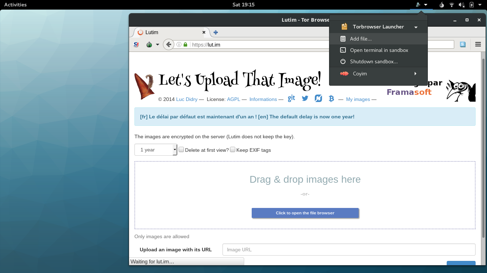

## Browsing the Web with Tor Browser

Tor Browser is the default web browser of Subgraph OS. It has a number of 
security and privacy advantages over other browsers. 

The security and privacy features include:

* Anti-fingerprinting countermeasures to prevent websites from identifying
individual users by their browser fingerprint
* A security slider that lets users disable browser features that may pose 
security and privacy risks

The Tor Browser runs inside a security sandbox, managed by Subgraph Oz. Web
browsers represent some of the most complex software available. With complexity
comes increased risk to security and privacy. This is what we call the `attack
surface` of an application. Tor Browser is no different than other browsers in
that it has a lot of attack surface. A successful compromise of Tor Browser 
could let an attacker gain access to things such as SSH keys, GPG encryption
keys, personal files, email, etc. Our security sandbox technology helps to 
mitigate these risks.

### Configuring the Tor Browser security slider

The Tor Browser includes a `security slider` that lets users choose the security
and privacy features they want to enable. If they enable all of the security and 
privacy settings, some websites may be slower or may not work as expected. 
However, the security slider lets them instantly lower the settings if they need 
a particular website to work better. 

We recommend setting the security slider to Medium-High or High. For websites
you trust, you can lower the settings to make the website perform better. 

We advise against lowering the security slider for any websites that are not
accessed over HTTPS. HTTPS helps to make sure that the traffic between the Tor
Browser and the website has not been tampered with. This is what we refer to
as the 'integrity' security property. If you cannot verify the integrity of
the traffic originating from a website by using HTTPS, it may be dangerous to 
visit the website using lowered security and privacy settings.

\newpage

### Downloading and saving files in the Tor Browser

The Tor Browser runs inside of Oz, our application sandbox. When files are 
downloaded by a sandboxed application such as the Tor Browser, they are saved 
within the sandbox. When you close the Tor Browser, Oz will cleanup the sandbox,
causing files saved in the sandbox to be destroyed. 

To allow the Tor Browser to download that can persist after the application is 
closed, Oz makes a special exception. This special exception is a `shared
directory` where files can be saved and retrieved later, without being destroyed 
when Tor Browser is closed. `Shared directory`, in this case, means a directory
that is shared inside and outside of the Oz sandbox. Oz sets up the the 
following shared directory for saving downloaded files:
```
~/Downloads/TorBrowser

```

The shared directory name may be localized depending on the language settings
on your computer. In the case of French, the shared directory would be:
```
~/Téléchargements/TorBrowser
```

Files downloaded to the shared directory will persist after closing the
Tor Browser.

### Uploading files in the Tor Browser

When the Tor Browser starts, the Oz sandbox limits its access to files and
directories on the computer. For example, a photo from the `Pictures` directory
will not be visible in the sandbox by default. If you want to upload a photo
from this directory, you must use the Oz menu to add it to the Tor Browser
sandbox. The Oz menu is denoted by the little zebra icon at the top-right corner 
of the screen.

> {#id .class width=60 height=60px}
> The following actions may be performed using the Oz menu:
>
> - Add files to sandbox
>
> - Open terminal in sandbox
>
> - Shutdown sandbox

\clearpage

Click on the little zebra and then click `Add file...`.  



You may add more than one file at a time. You may
also choose to make these files `read-only`, meaning that they can only be 
read and not written to while in the sandbox.


\clearpage

Once the file(s) you want to upload are added to the Tor Browser sandbox, you
may proceed to upload them normally.


