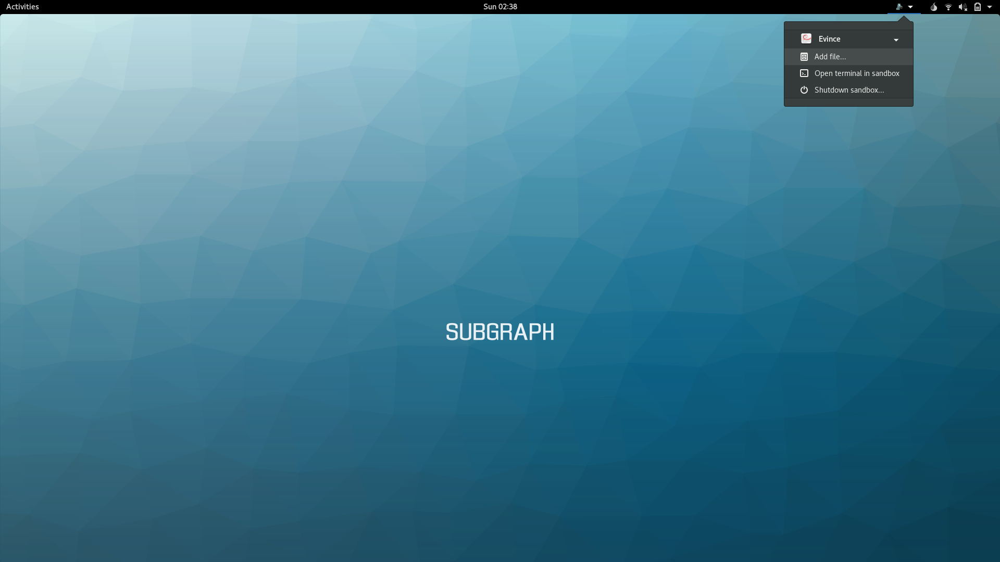
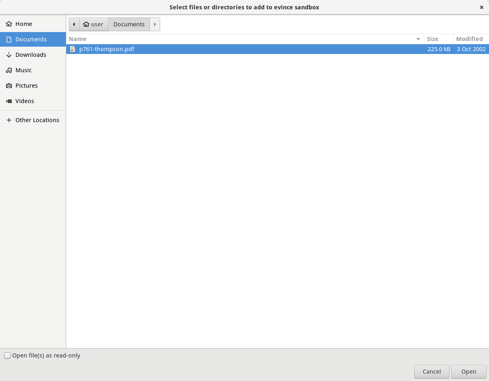

## Viewing PDFs

PDFs present security and privacy risks to users. Subgraph OS sandboxes
PDFs in a safe environment, minimizing those risks. 

PDFs are affected by the following security and privacy risks:

1. PDF readers have security vulnerabilities that can be exploited by opening a
   malicious PDF
2. PDFs may make outgoing connections to the Internet, compromising the user's
   privacy either by sending personally identifiable information or network
   traffic that can be correlated with the user's other activities

 
To address the first problem, the security hardening in Subgraph OS makes it
much more difficult to exploit security vulnerabilities in the PDF reader
(**Evince**).

If a malicious PDF bypasses the security hardening in Subgraph OS, it
compromises the PDF reader. However, because **Evince** runs inside of a sandbox, 
this limits what an attacker can do. The sandbox in Subgraph OS is called 
**Oz**.

The sandbox prevents **Evince** from accessing sensitive files on
the computer, such as your encryption keys, email, personal documents, etc. 
**Evince** only requires access to the PDF(s) it is reading and some other files 
it needs to operate normally.

**Oz** also prevents **Evince** from connecting to the Internet. This can prevent 
malicious code from communicating with the outside world. Privacy is also 
preserved since **Evince** cannot send data that can *fingerprint* the user.

Lastly, the sandbox limits other types of actions through a Linux feature called
*seccomp*.

> *What is a system call?*
>
> System calls provide a way for applications, which run in *user-space*, to
> ask the kernel (running in *kernel-space*) to do things such as read and write 
> files, communicate over the network, etc. 
>
> When a *user-space* application makes a system call to do something such as 
> open a file, the kernel must perform a number of low-level actions. The 
> kernel may be responsible for the file system implementation, authorizing the 
> application to access the file, reading the file contents from the hard-drive, 
> etc. The kernel must run with *elevated privileges* in relation to the
> application to perform these low-level actions. System calls let applications 
> cross the boundary between *user-space* and *kernel-space* without requiring 
> the application to run with kernel-level privileges.
>
> System calls are critical to security because they provide an interface for 
> lower-privileged applications to send input to the kernel. 
>
> See the Appendix for a complete list of system calls in Subgraph OS.

Sandboxed applications in Subgraph OS include a set of policies called a 
*seccomp whitelist*. If an attacker compromises an application, this security 
feature can prevent them from gaining elevated privileges on your computer.
 
> *What is seccomp?*
>
> *Seccomp* is a security feature of Linux that can restrict access to
> system calls. If an application tries to run one of the system calls
> restricted by *seccomp*, it will be killed instead of allowing the
> system call to run. This can prevent privilege escalation in case malicious
> code tries to exploit kernel vulnerabilities through system calls. System
> calls are often used as a *payload* in malicious code to do some things as
> read files or open network connections. *Seccomp* can also prevent *payloads*
> from running if they use system calls are that blocked by the policy.
>
> *What is a seccomp whitelist?*
>
> A *seccomp whitelist* is a list of allowed system calls. If the application 
> tries to call any system call *not* on this list, it is killed by *seccomp*.
>
> *What is a seccomp blacklist?*
>
> A *seccomp blacklist* is a list of forbidden system calls. If the application
> tries to call any system call *on* this list, it will be killed by *seccomp*. 
> This is in contract to the whitelist, which blocks the calls *not* on the 
> list.
>
> The **Oz** sandbox in Subgraph OS supports both *seccomp whitelists* and 
> *seccomp blacklists*. 
 
\newpage

### Opening PDFs with Evince in the file explorer


Clicking on a PDF in the file explorer will automatically open the PDF using 
**Evince** in the **Oz** sandbox.

### Adding PDFs to Evince from the Oz menu

If the PDF reader is already open, the PDF can be added to the sandbox by
clicking on *Add file...* option of the *Oz menu* for **Evince**.



\newpage

You may add multiple files. You can also make these files *read-only*, meaning
that they cannot be modified in the sandbox.



\clearpage

### Opening PDFs from the command-line terminal

PDFs may also be opened from the terminal. 

For example, to open this handbook using **Evince** in the terminal, run the 
following command:

```{.bash}
$ evince sgos_handbook.pdf
```

After running the command, you will see the following message:
```
ok received
```

This message indicates that **Oz** has received the request to launch *Evince*.

You may be surprised that opening the PDF from the terminal also opens it in the
sandbox. This is because **Oz** re-routes the commands so that they run in the 
sandbox. For any application that runs in **Oz**, you may launch it from the 
desktop *or* the command-line terminal.

\newpage 

