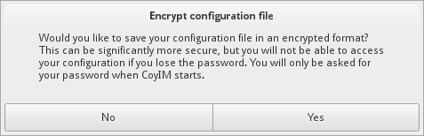
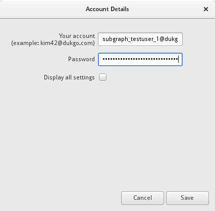

## Chatting with CoyIM

**CoyIM** is one of the instant messaging clients in Subgraph OS. **CoyIM**
supports the *Jabber/XMPP* instant messaging protocol. All chats are end-to-end
encrypted using *OTR* (Off-the-Record) Messaging.

**CoyIM** is developed by the *ThoughtWorks STRIKE* team as a more secure
alternative to chat software such as **Pidgin** and **Adium**.

More information about **CoyIM** can be found here:

https://coy.im/

\newpage

### Adding an XMPP account to CoyIM

When **CoyIM** opens for the first time, it asks you if you want to encrypt your
configuration file. We recommend that you encrypt your configuration.

If you have decided to encrypt your configuration file, you will be prompted
to configure the master password that will be used to encrypt your 
configuration file. You will need to re-enter this password each time you
use **CoyIM**, so choose something strong but memorable! 

To begin using CoyIM, you must first add an existing account from an *XMPP*
network. 

Once you had added your account details, you can connect your account. If
you have successfully connected to the chat network, a *green* dot will appear
to the left of your username.

\clearpage

