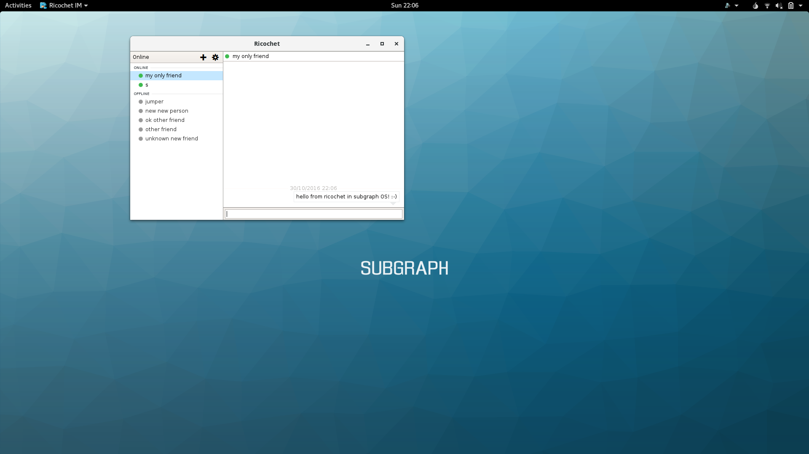
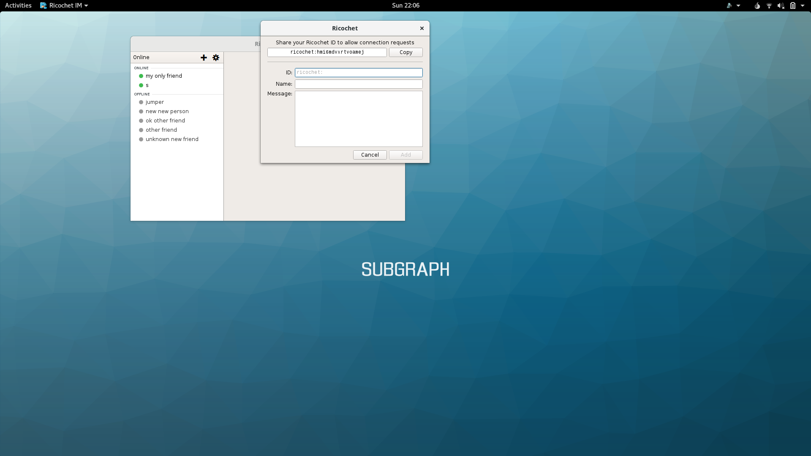

## Chatting over Tor with Ricochet

**Ricochet** is an anonymous peer-to-peer instant messaging application.
**Ricochet** lets people chat directly with each other over Tor. Unlike other
chat services, no intermediate servers are required. This means that
**Ricochet** does not store your contact lists and chat histories on a server
somewhere in the cloud.

**Ricochet** is built on top of Tor hidden services. Tor hidden services provide
anonymity and end-to-end encryption. This enables people to have conversations
that are private and secure.

> *What is a Tor hidden service?*
>
> Tor hidden services provides a means of hosting services on the Tor network.
> Any type of network service may be hosted as a hidden service (such as web
> servers, file shares, and instant messaging servers).
>
> Instead of using an IP address or domain name, Tor hidden services are
> accessed by their *.onion* address. The *.onion* address is an automatically 
> generated name that is derived from the public key of the hidden service. 
>
> *.onion* addresses are only accessible over Tor. **Tor Browser** is one way to 
> access *.onion* addresses. In Subgraph OS, any application can access *.onion*
> addresses because all applications are routed through Tor.  
> 
> Tor hidden services provide privacy and anonymity for both the server and the 
> client. Tor hidden services have the following benefits over
> regular network services:
>
> 1. Neither the client nor the server need to know the network location (IP
>    address) of each other. Tor routes traffic through a series of rendezvous
>    points that hide the client IP address from the server. The server's
>    network location (IP address) is also hidden from the client, who connects
>    to the *.onion* address of the server.
> 2. All traffic between the client and server is end-to-end encrypted. Traffic
>    never leaves the Tor network, meaning that it is only decrypted on either
>    end of the transaction. When Tor is used to connect to the regular
>    Internet, traffic is only encrypted until the *exit-node*. Without using
>    another layer of encryption such as HTTPS, exit nodes can observe traffic.
>    Tor hidden services are not affected by this limitation.
>
> More information about the hidden services protocol can be found here:
>
> <https://www.torproject.org/docs/hidden-services.html.en>

In **Ricochet**, each user has a *contact ID* that maps to a Tor hidden service
that is hosted on their computer. The application manages all of the plumbing of
creating the hidden service on your computer and communicating with your
contacts via their hidden services.  

More information about Ricochet can be found on the following pages:

* <https://ricochet.im/>
* <https://github.com/ricochet-im/ricochet/blob/master/doc/design.md>

\newpage

### Chatting in Ricochet

**Ricochet** is similar to other instant messaging clients. The application
shows the contacts that are online. You can open chat sessions with your 
contacts and switch between those sessions like in any other instant messager.

\newpage

### Adding a contact in Ricochet

If you know the *contact ID* of another user, you can add them as a contact. To
add a contact, click the **+** button in the top-left corner of the application
window.

> **Ricochet contact options**
>
> *ID*: The *contact ID* of the contact you want to add
>
> *Name*: A nickname for the contact you want to add
>
> *Message*: The message you want to send when adding the contact

\newpage

