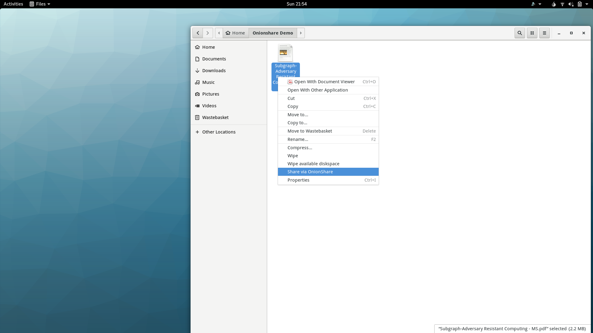
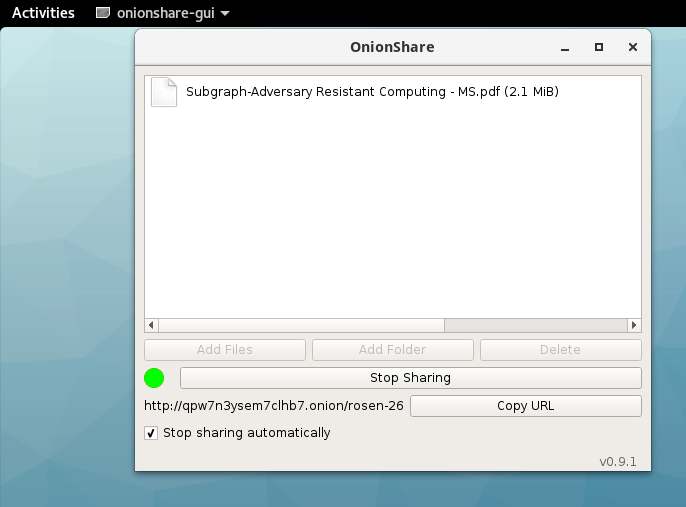
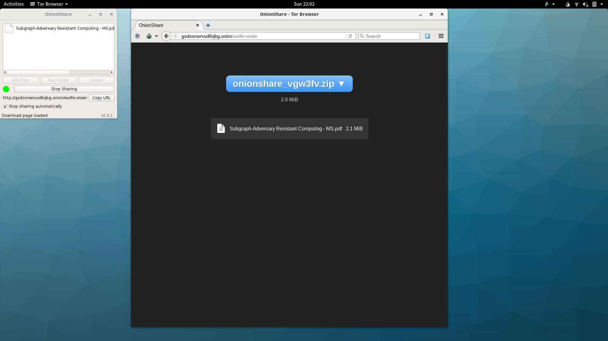

## Sharing files with OnionShare

**OnionShare** is a anonymous, peer-to-peer file sharing application. It lets people 
share files of any size private and securely. 

**OnionShare** is built on top of Tor hidden services. There are a number of
security and privacy advantages to sharing files over Tor hidden services using
**OnionShare**.

1. Tor hidden service connections are end-to-end encrypted, meaning that the
   file transfer is encrypted at every point between the client and server.
2. Tor hidden service connections are anonymous. File transfers can occur
   without the either the client or the server knowing the IP address of each
   other. The server is hidden behind an *.onion* address on the Tor network.
   The client is hidden because it connects to the hidden service through
   different rendezvous points.
3. *OnionShare* file shares are designed to be short-lived. They can shut down
   after the file transfer occurs, meaning the server stops listening and the
   *.onion* address disappears from the Tor network.

Subgraph OS enhances the security of **OnionShare** by sandboxing it with
 **Oz**. File shares exist in their own sandbox, without access to other 
sensitive files on the computer. If **OnionShare** is affected by a security 
vulnerability, running it **Oz** limits the consequences of the vulnerability.

When a user shares files, **OnionShare** starts a hidden service with its own 
*.onion* address. The user then sends the *.onion* address to the people they 
wish to share files with. The *.onion* address should be sent over a 
*secure communication channel*. This is important to prevent unwanted parties 
from accessing your shared files. Once files are shared, people with the 
*.onion address* can download the files using the **Tor Browser**.

> *What is a secure communication channel?*
>
> A communication channel is secure if people can communicate with some
> expectation that their conversation cannot be intercepted or tampered with.
> Ideally, all communications should be encrypted along with their metadata.
> Metadata includes things such as the time, date, and frequency of the 
> conversations. It can also include the identities and location of the people 
> who are communicating. Even without the content of a conversation, metadata
> can reveal a lot about the nature of the communication.
>
> Establishing *truly* secure communications channels is difficult. Many
> communications tools rely on third-parties, making them privy to
> communications metadata. This may include the third-party servers themselves 
> or intermediary servers that pass on the communications. Communications, 
> even encrypted ones, often leak metadata as they travel to their final 
> destination.
>
> Subgraph OS includes applications to help our users communicate over secure
> channels. These examples are ranked according to the amount of metadata they
> reveal:
>
> * Ricochet instant messager (uses Tor hidden services for anonymity and 
> end-to-end encryption, no metadata, no third-party servers required)
> * CoyIM instant messager (uses the XMPP protocol, some metadata, requires 
>  third-party servers)
> * Encrypted email using Icedove/Torbirdy (uses the SMTP protocol, lots of 
> metadata, requires third-party servers)

More information about **OnionShare** is on the following website:

https://github.com/micahflee/onionshare

\newpage

### Share via OnionShare

**OnionShare** is integrated into the file explorer of Subgraph OS. To share a file,
*right-click* on the file and select *Share via OnionShare*.

\newpage 

Selecting *Share via OnionShare* will start **OnionShare** and open the
 **onionshare-gui**. It may take a few seconds for OnionShare to create the 
hidden service. The status indicator will turn *green* when it is ready.

**onionshare-gui** includes the following options to manage shared files:

* Add Files
* Add Folder
* Delete (Files and Folders)
* Stop Sharing (all files and folders, this closes **OnionShare**)

OnionShare runs inside of the **Oz** sandbox. To add files and folders after
OnionShare has started, they must be added through the **Oz** menu at the top
right corner of the desktop. See the section on *Viewing PDFs* for further
information on adding files and folders to an application in the **Oz** sandbox.

The URL for the hidden service (the *.onion* address) is provided along with a
button to *Copy URL* to the clipboard. This URL should be sent over a 
*secure communication channel* to the people you want to share files
with. 

The *Stop sharing automatically* checkbox determines whether **OnionShare** will
close automatically after the file is downloaded by a user. Un-check this option
if you are sharing files with multiple users.

### Download files from OnionShare

**OnionShare** runs as a Tor hidden service. To download files over 
**OnionShare**, you can use the **Tor Browser**. Paste the *.onion* 
address for the file share into the address bar of **Tor Browser**. This will 
open the web interface for **OnionShare**. 

**NOTE**: In this screenshot, **OnionShare** (the server) and **Tor Browser**
(the client) are both running on the same computer. Because the **OnionShare**
server is only accessible over a Tor hidden service, **Tor Browser** connects
to the file share over Tor. This is the case even if they are running on the
same computer. Of course, normally the server and the client would run on
different computers

\newpage

