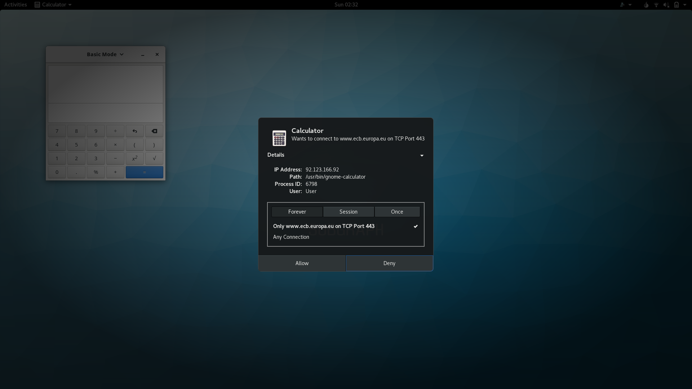
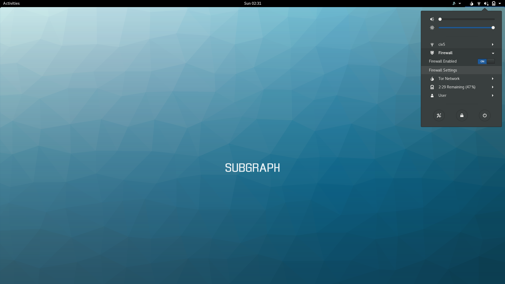
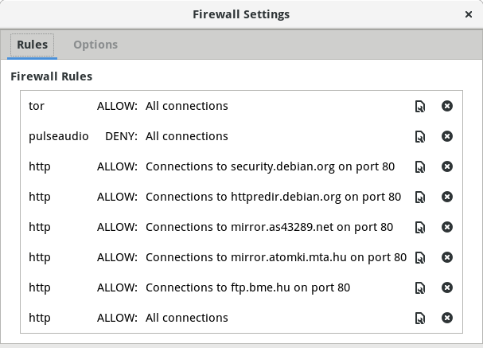
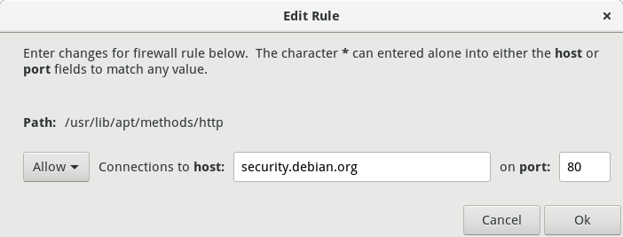
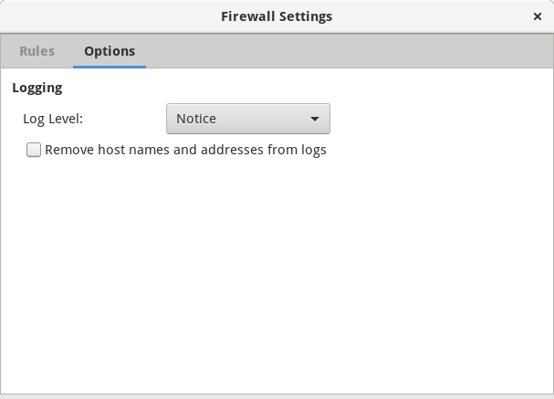

## Monitoring outgoing connections with Subgraph Firewall

**Subgraph Firewall** is an *application firewall* that is included in Subgraph 
OS. While most firewalls are designed to handle incoming network communications, 
an *application firewall* can handle outgoing network communications. **Subgraph
Firewall** can apply policies to outgoing connections on a per-application 
basis.

*Application firewalls* are useful for monitoring unexpected connections from
applications. For example, some applications may *phone home* to the vendor's
website. Often this activity is legitimate (non-malicious) but it still may
violate the user's privacy or expectations of how the software operates.
Subgraph Firewall gives users the choice to allow or deny these connections.

Malicious code may also *phone home* to a website or server that is operated by
the hacker or malicious code author. Subgraph Firewall can also alert the user
of these connections so that they can be denied. 

*Application firewalls* cannot prevent all malicious code from connecting to the
Internet. Sophisticated malicious code can subvert the *allowed* connections to
bypass the firewall. However, the firewall may alert the user of connection
attempts by less sophisticated malicious code. 

Our *application firewall* makes Subgraph OS unique. It is not found in other
Linux distributions. Normally, applications will make outgoing network
connections without the knowledge or consent of the user. Subgraph OS helps
mitigate these security and privacy risks by making users aware and giving them
the power to decide how applications connect to the Internet.

### Allowing or denying connections in Subgraph Firewall

When Subgraph Firewall sees a connection it does not have a policy for, it 
prompts the user to *allow* or *deny* the connection. The prompt includes
options to define the duration of the policy and the scope. By scope, we mean
apply the policy for the application to a specific destination or to any
connection made by the application.

\clearpage

> While developing Subgraph Firewall, we noticed some unusual behavior from
> **Gnome Calculator**. We didn't expect that a calculator would need to connect
> to the Internet and so we were surprised to see a prompt from **Subgraph
> Firewall**. **Gnome Calculator** connects to various bank websites to fetch
> the exchange rates for currency conversions.
>
> This type of unexpected behavior is one of the reasons we created **Subgraph
> Firewall**. **Gnome Calculator** doesn't give the user the choice to fetch the
> exchange rates. **Subgraph Firewall** puts that choice back in the hands of
> the user.

> **Subgraph Firewall Allow/Deny prompt options**
>
> At the top of the prompt is the name of the application making the connection
> as well the destination hostname and port.
>
> *IP address*: The destination IP address
>
> *Path*: The path to the application that is making the connection
>
> *Process ID*: The process ID of the application that is making the connection
>
> *User*: The user who started the application that is making the connection
>
> *Allow/Deny* duration
>
> *Forever*: *Allow* or *Deny* the connection forever (this can be changed
> afterwards in the Subgraph Firewall settings)
>
> *Session*: *Allow* or *Deny* the connection until logging out of the desktop
> session
>
> *Once*: *Allow* or *Deny* the connection once (the prompt will re-appear if
> the application attempts the connection again)
>
> *Allow/Deny* scope
>
> *Only hostname on port*: Allow/Deny the connection for this application
> only for the *hostname* and *port* listed at the top of the firewall prompt
>
> *Any Connection*: Allow/Deny any connection made by the application

\newpage

### Configuring firewall rules in Subgraph Firewall

To configure the firewall rules, select the **Firewall -> Firewall Settings**
option from the *Gnome User Menu* at the top right corner of the desktop.

\newpage

This will open the **Firewall Settings** configuration window.

\newpage

The configuration window shows all of the existing rules. 

Each rule has the following columns:

* Application name
* A policy setting of *ALLOW* or *DENY*
* The scope of the policy

The last two options are to *Edit* or *Delete* a firewall rule.

If you click the *Edit* button (the button with the wrench), you will be
prompted to edit the *Allow/Deny* policy and its scope.

\newpage

The *Options* tab of the **Firewall Settings** window lets you configure general
options for **Subgraph Firewall**.

 

\clearpage

