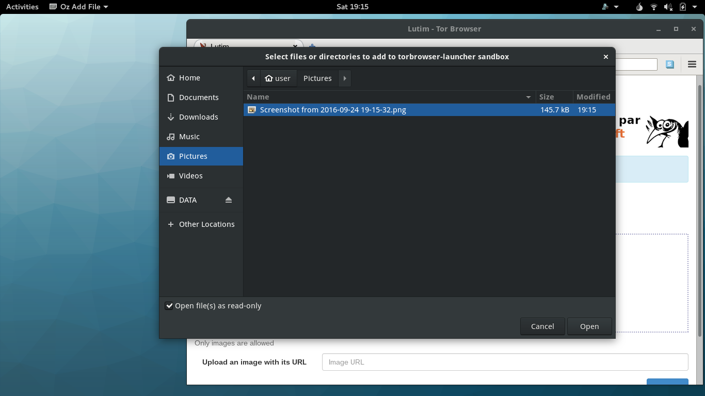

# Usage

## Adding files to a sandbox

Sandboxes have limited access to the host files and directories. This means that if you save a picture in `~/Pictures`, it would not be available to a sandboxed program. You may want to access this file from the sandbox to upload this picture from the Tor Browser, for example, to do this you will use the OZ Menu available at the top-right of the screen (the blueish zebra icon) and select «Add file...».

You will be prompted to select which file you would like to add; you may add more than one file at a time, and you may chose to make these files only available to reading (read-only mode) inside the sandbox.

Some sandboxes will automatically add any files passed as an argument, or similarly double clicked, to the sandbox. For example: double clicking on a PDF opens the Evince sandbox with the PDF files made available.

\newpage

## Saving files from a sandbox

As of this writing, every sandbox profile provided by `subgraph-oz-profiles` includes a shared directory where one can save files and retrieve them from the host. For example, the Tor Browser sandbox shares the `~/Downloads/TorBrowser` directory; any files saved there from the sandbox are also available in the host. These directories may be localized following the system settings; on a French system the same directory would be under `~/Téléchargements/TorBrowser`. Generally speaking, files saved outside of this shared directory will be destroyed when the sandboxes closes.

\newpage

# Features

## Sandboxing applications with Subgraph Oz

\newpage

### Securing sandboxed applications with Oz seccomp

\newpage

