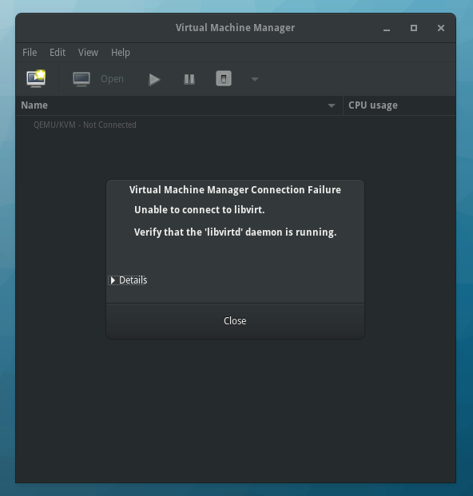
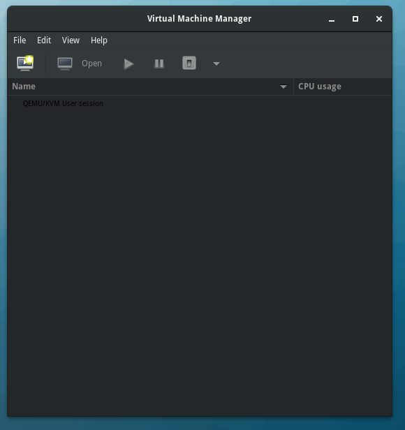
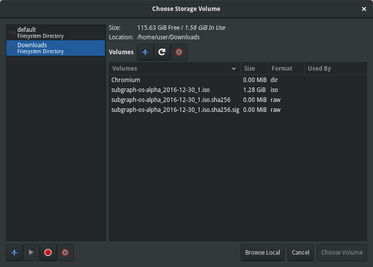
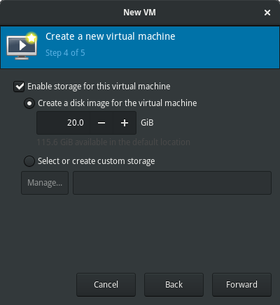
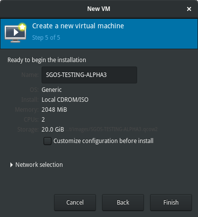
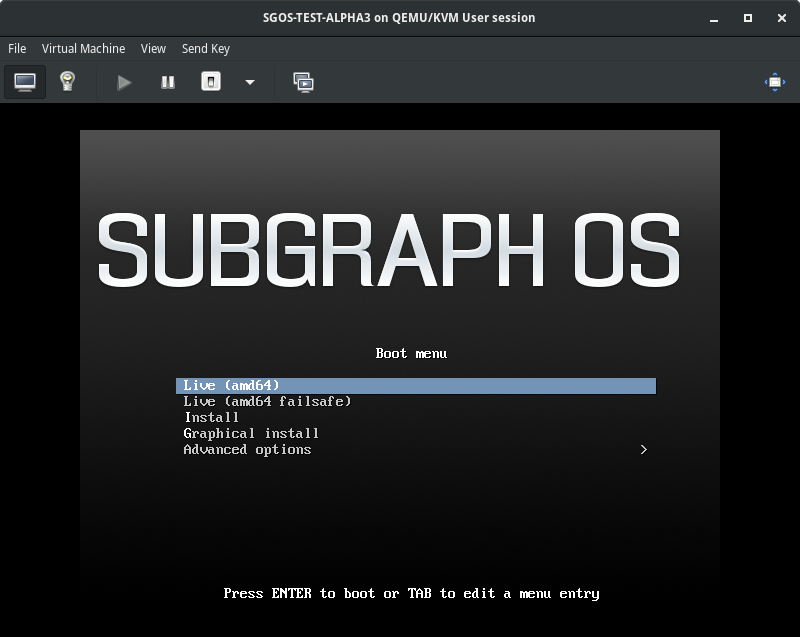

## Using virtual machines in Subgraph OS

Contrary to popular belief, there is nothing that stops the use of virtual 
machines in Subgraph OS. While the *Grsecurity* kernel is not compatible with 
VirtualBox, **Qemu/KVM** works as expected. However, you must install 
**Qemu/KVM** yourself if you want to run virtual machines.

Running the following command with install **Qemu/KVM**:
```{.bash}
$ sudo apt install qemu-system qemu-kvm qemu-utils
```

The following sections are recipes  on how to use **Qemu/KVM** in Subgraph OS. 
They are similar to our own workflows for developing and testing Subgraph OS. 
**Qemu/KVM** supports many more options than what we use in these tutorials. 
For more detailed information regarding the operation of **Qemu/KVM**
virtual machines, see the official **Qemu** manual:

<http://wiki.qemu.org/Manual>

There are multiple third-party graphical user interfaces for **Qemu/KVM**. These 
may make it easier to configure and manage virtual machines. You can explore the
various options by visiting these pages:

* <https://wiki.gnome.org/Apps/Boxes>
* <http://virt-manager.et.redhat.com>
* <http://qemuctl.sourceforge.net>
* <https://launchpad.net/virtualbrick>

### Simple usage with Virt-Manager

One option is to use the **virt-manager** frontend for **libvirt** and **Qemu/KVM**.
This requires some extra dependencies, but is far more user friendly.

You will want to install it along with the following dependencies:
```{.bash}
$ sudo apt install virt-manager libvirt-daemon virt-viewer gir1.2-spice-client-gtk-3.0
```

After the installation is complete you can launch **virt-manager** from __GNOME Activities__.

#### Configuring virt-manager for session mode

On first launch we are prompted with an error about a failed connection to the libvirt daemon:



This error can be ignored; to avoid it the future we will right-click on the only entry in the list 
**QEMU/KVM - Not Running** and delete it. 


Now we need to add a session mode connect. For this go into the the **File** menu, and select 
**Add Connection...**. A new window will appear, you will need to select **QEMU/KVM user session**
in the hypervisor popup menu.


We are now ready to use **virt-manager**



#### Creating a simple virtual machine in virt-manager

Click on the create new virtual machine button and you will be prompted to start configuring the virtual machine:


When selecting a disk image to install, you will probably notice that libvirt looks in an odd location for disk images.
The default location is `~/.local/share/libvirt/images`. You can add more, or more simply you can just ignore this,
and select **Browse Local** to freely select and image.



Continue with the configuration of the basic attributes of your virtual machine:






Once done your virtual machine will start automatically:



You can proceed with a regular installation, use a live image, etc.

You may install the **qemu-guest-agent** and/or **spice-vdagent** and/or **xserver-xorg-video-qxl** in the running
virtual machine to improve integration (though this is not strictly necessary and may present extra security concerns).

### Command line usage

For a more minimal, and sometimes more advanced, usage one may also use **Qemu/KVM** on its own from the command line.

#### Creating a basic Linux virtual machine with Qemu

Prior to creating the virtual machine, you should create a virtual hard-drive 
image for it:

```{.bash}
$ qemu-img create -f qcow2 disk.qcow2 8G
```

Your virtual hard-drive is now ready for use. Run the following command to
test a virtual machine with the hard-drive:

```{.bash}
$ qemu-system-x86_64 -enable-kvm -hda ./disk.qcow2 -m 4096
```

To start a virtual machine with an operating system ISO attached to the virtual 
CDROM, run the following command:

```{.bash}
$ qemu-system-x86_64 -enable-kvm -hda ./disk.qcow2 -m 4096 \
-cdrom ./subgraph-os-alpha_2016-06-16_2.iso -boot d
```

> **Qemu/KVM options**
>
> *-enable-kvm*: enables **KVM** virtualisation, which is faster than 
> **Qemu's** emulation
>
> *-hda*:  This attaches the virtual hard-drive you created
>
> *-m*: This allocates RAM to the virtual machine (4096MB in the example)
> 
> *-cdrom*: The path to the operation system ISO
>
> *-boot*: This specifies the boot order for the virtual machine, *d* is the
> virtual CDROM

This example can be adapted to run the Linux distribution of your choice inside of
a virtual machine.

\newpage

#### Creating an advanced Debian Stretch virtual machine using debootstrap

To have more control over the installation of Debian inside of a virtual
machine, you can use **debootstrap** to install the operating system. Another
advantage of this approach is that you can avoid all of the installation dialogs
of the **Debian installer**.

This section will show how to install Debian Stretch with the *Grsecurity* 
kernel from Subgraph OS.

##### Create a virtual hard-drive image for the operating system

To begin the install, you must set up a virtual hard-drive image. Follow these
steps to set it up:

1. Run the following command to create a sparse virtual hard-drive image:
```{.bash}
$ truncate --size 8G ./disk.img
```

2. To format the virtual hard-drive run the following command:
```{.bash}
$ /sbin/mkfs.ext4 ./disk.img
```
After formatting the hard-drive, you can create a proper partition table. We
will skip this step in the tutorial as it is not strictly necessary to run the
virtual machine.

3. Mount the virtual hard-drive:
```{.bash}
$ sudo mount -o loop ./disk.img /mnt
```

**NOTE:** You should ensure there is enough free space in the image you
create. You may want to allocate twice as much if you want to convert the image
later on.


The sparse virtual hard-drive image you created will only use as much space as
it requires.

Run the following command to show how much space is used by the image:

```{.bash}
$ du -sh disk.img
```

The amount shown is a fraction of the total amount specified in the *truncate*
command:
```
189M	disk.img
```

To verify the total amount that was specified in the *truncate* command, run
this command:
```{.bash}
$ du --apparent-size -sh disk.img
```

The total amount should correspond with what was specified when you ran 
*truncate*:
```
8.0G	disk.img

```

##### Installing the operating system with deboostrap

Now that the virtual disk-image is created, we can now use **debootstrap** to
install Debian Stretch. Follow these steps to install it:

1. Run **debootstrap** to install the operating system:
```{.bash}
$ sudo debootstrap --variant=mintbase --include=systemd-sysv stretch /mnt
```

2. Set a *root* password for the installed operating system:
```{.bash}
$ sudo chroot /mnt passwd
```

3. Create a standard fstab configuration:
```{.bash}
$ sudo tee /mnt/etc/fstab << EOL
/dev/sda	/	ext4	defaults,errors=remount-ro	0	1
EOL
```

##### Installing the Grsecurity kernel in the operating system

Run the following commands to install the Subgraph OS *Grsecurity* kernel in 
your virtual machine:
```{.bash}
$ cd /tmp
$ apt-get download linux-{image,headers}-grsec-amd64-subgraph linux-{image,headers}-$(uname -r)
$ sudo cp ./linux-{image,headers}-$(uname -r) /mnt/tmp
$ sudo chroot /mnt
$ dpkg -i /tmp/linux-{image,headers}-*
$ update-initramfs -u -k all
$ exit
```


The kernel and initramfs are inside of your mounted virtual hard-drive image. 
You must copy them to a directory on your computer to boot the virtual machine
using these files. Run the following command to copy the files to the directory
you want to start the virtual machine from:
```{.bash}
$ cp /mnt/boot/vmlinuz-<version>-amd64 /mnt/boot/initrd.img-<version>-amd64 \
/home/user/path/to/vm
```

##### Finalizing the installation of the operating system

As the final step, we will sync the filesystem and unmount the virtual
hard-drive image:
```{.bash}
$ sync
$ sudo umount /mnt
```

(Optional) If you prefer, you may convert the virtual hard-drive image to the
*qcow2* format:

```{.bash}
$ qemu-img convert -f raw -O qcow2 ./disk.img ./disk.qcow2
```

##### Starting the Debian Stretch virtual machine

Now you are ready to start the virtual machine. Run the following command to
start it:

```{.bash}
$ qemu-system-x86_64 -enable-kvm -hda ./disk.qcow2 \
	-kernel ./vmlinuz-<version>-amd64 \
	-initrd ./initrd.img-<version>-amd64 \
	-append root=/dev/sda
```
**NOTE:** This assumes you converted the virtual hard-drive image to the
*qcow2*. If not, replace **disk.qcow2** with the correct name of your image.

> **Qemu/KVM options**
> 
> This section uses some new options for **Qemu/KVM**.
>
> *-kernel*: This is the operating system kernel to boot when starting a virtual
> machine
>
> *-initrd*: This is the initramfs to boot when starting a virtual machine
>
> *-append*: These are options to append to the kernel command line when
> starting a virtual machine


If you want to install grub to keep the kernel and initrd images inside the 
virtual machine you'll have to create a full partition table. You may also need
to create a separate **/boot** partition. But this is out of scope for this 
tutorial.

#### Setting up simple networking in Qemu/KVM

By default, **Qemu** will transparently *NAT* your virtual machines to the host 
network. This can be disabled by using the **-net none** flag.

Alternatively, you can also open simple tunnels between the host and the 
virtual machine using the port redirection mechanism with the **-redir** flag:

```
-redir tcp:55700::55700
```

For more on networking in **Qemu/KVM** see:

* <http://wiki.qemu.org/Documentation/Networking>
* <https://en.wikibooks.org/wiki/QEMU/Networking>

\newpage

