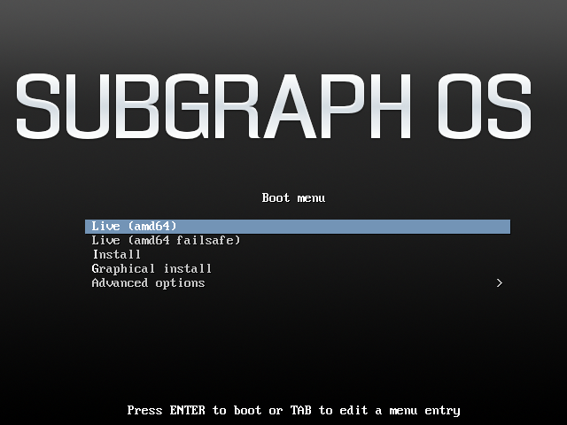

# Installing Subgraph OS

\newpage

## Installation methods

\newpage

### Installing from a CD or DVD

\newpage

### Installing from a USB key

\newpage

### Booting from a USB key (Live mode)

Subgraph OS also features a 'live' mode. Subgraph OS live mode runs in memory, 
directly from the USB stick. While running in live mode, nothing
will be saved to your hard-drive. When the live session ends, any data created
during your session will disappear, leaving no traces behind on the hard-disk. 
\
\
People normally run in live mode for the following reasons:

1. They want to demo Subgraph OS
2. They want to test Subgraph OS with their particular hardware
3. They want to perform certain tasks with extra security and privacy but
do not want a permanent installation of Subgraph OS

\newpage

When the Subgraph OS ISO starts, you will be presented with different options.
To start the live mode, select `Live (amd64)`.

\newpage

## Installing, step\-by\-step

\newpage

## After the First Boot

\newpage
