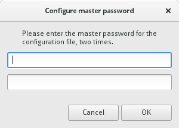

# Everyday usage

\newpage

## Browsing the Web with Tor Browser

Tor Browser is the default web browser of Subgraph OS. It has a number of 
security and privacy advantages over other browsers. 

The security and privacy features include:

* Anti-fingerprinting countermeasures to prevent websites from identifying
individual users by their browser fingerprint
* A security slider that lets users disable browser features that may pose 
security and privacy risks

The Tor Browser runs inside a security sandbox, managed by Subgraph Oz. Web
browsers represent some of the most complex software available. With complexity
comes increased risk to security and privacy. This is what we call the `attack
surface` of an application. Tor Browser is no different than other browsers in
that it has a lot of attack surface. A successful compromise of Tor Browser 
could let an attacker gain access to things such as SSH keys, GPG encryption
keys, personal files, email, etc. Our security sandbox technology helps to 
mitigate these risks.

## Configuring the Tor Browser security slider

The Tor Browser includes a `security slider` that lets users choose the security
and privacy features they want to enable. If they enable all of the security and 
privacy settings, some websites may be slower or may not work as expected. 
However, the security slider lets them instantly lower the settings if they need 
a particular website to work better. 

We recommend setting the security slider to Medium-High or High. For websites
you trust, you can lower the settings to make the website perform better. 

We advise against lowering the security slider for any websites that are not
accessed over HTTPS. HTTPS helps to make sure that the traffic between the Tor
Browser and the website has not been tampered with. This is what we refer to
as the 'integrity' security property. If you cannot verify the integrity of
the traffic originating from a website by using HTTPS, it may be dangerous to 
visit the website using lowered security and privacy settings.

\newpage

## Viewing PDFs

PDFs can present security and privacy risks to users. Subgraph OS sandboxes
PDFs in a safe environment, minimizing those risks. 

PDFs are affected by the following security and privacy risks:

1. Security vulnerabilities in the PDF reader software may allow adversaries
to compromise a user who opens a malicious PDF
2. Privacy may be compromised if the PDF makes an outgoing connection to the
Internet, such as when the user clicks on a link within the document or if
the document automatically opens a link

\newpage

## Chatting with CoyIM

CoyIM is the default instant messaging application in Subgraph OS. CoyIM
supports the XMPP instant messaging protocol. All chats are end-to-end
encrypted using OTR (Off-the-Record) Messaging.

### Adding an XMPP account to CoyIM

When CoyIM opens for the first time, it asks you if you want to encrypt your
configuration file. We recommend that you encrypt your configuration.

If you have decided to encrypt your configuration file, you will be prompted
to configure the master password that will be used to encrypt your 
configuration file. You will need to re-enter this password each time you
use CoyIM, so choose something strong but memorable! 

To begin using CoyIM, you must first add an existing account from an XMPP
network. 

Once you had added your account details, you can connect your account. If
you have successfully connected to the chat network, a green dot will appear
to the left of your username.

\newpage

